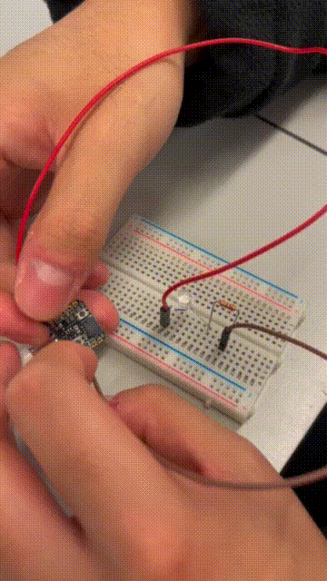

### LED action

Here is the LED experiment. We use RP2040 REPL to toggle a data pin on the Stemma QT connector in response to keystroke input.

### Proposal

Basically, We plan to build a instruments with RP2040. The idea is that, we could press the keyboard on our laptop and send signal to RP2040. The RP2040 could process the keyboard signal and give the corresponding pitch to the Speaker so it gives different music scale. Also, we could use the 7-segment displays to show the current scale. 

#### Component requirement 

- RP2040 Board

- AST-03208MR-R Speaker

- 5641AS 7-segment display

- Cables

  

